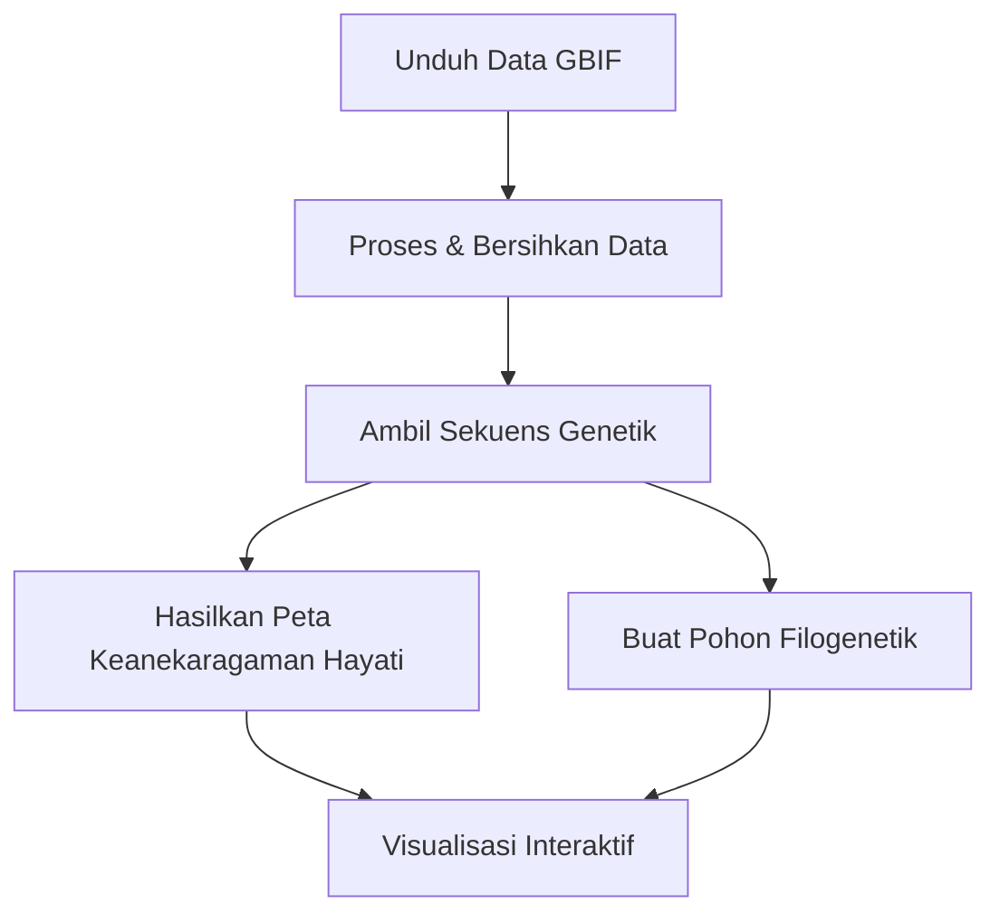

# BioNusantara
BioNusantara adalah proyek analisis data keanekaragaman hayati yang berfokus pada biogeografi di Indonesia, termasuk Garis Wallace dan Weber yang memisahkan kawasan fauna Asia, Wallace, dan Australasia.

## Tech Stack

Proyek ini menggunakan bahasa, library, dan service berikut:

### Main
- **Python**: Bahasa pemrograman utama
- **Pandas/GeoPandas**: Manipulasi data dan analisis geospasial
- **Biopython**: Analisis sekuens biologis dan filogenetik
- **Folium**: Visualisasi peta interaktif

### API dan External Service
- **GBIF API** Global Biodiversity Information Facility untuk data kemunculan spesies
- **NCBI Entrez API**: Untuk mengambil sekuens genetik

### Library
- **Shapely**: Operasi geometris untuk data spasial
- **MAFFT**: Multiple sequence alignment 
- **Matplotlib**: Untuk menghasilkan visualisasi pohon filogenetik

### Format Data
- CSV: Data kemunculan keanekaragaman hayati mentah
- GeoJSON: Data keanekaragaman hayati spasial yang telah diproses
- FASTA: Data sekuens genetik
- Newick: Format pohon filogenetik

## Struktur Proyek

```
bionusantara/
├── data/
│   ├── raw/                     # Data kemunculan GBIF mentah
│   └── processed/               # Data yang digunakan oleh script
├── output/                      # HTML app utama
│   └── phylo_trees/             # Gambar pohon filogenetik
└── scripts/   
    ├── gbif_downloader.py       # Mengunduh data keanekaragaman hayati dari GBIF
    ├── data_processing.py       # Membersihkan data dan mengambil sekuens dari NCBI
    ├── geospatial_analysis.py   # Membuat peta keanekaragaman hayati interaktif
    └── phylogenetic_analysis.py # Menghasilkan pohon filogenetik
```

## Pengaturan dan Instalasi

### Requirement
- Python 3.7 atau lebih tinggi
- Pastikan path tools MAFFT Disesuaikan

### Langkah-langkah Instalasi

1. Clone repositori:
   ```bash
   git clone https://github.com/shafiqIrv/kds .
   ```

2. Buat dan aktifkan lingkungan virtual:
   ```bash
   python -m venv .venv
   # Di Windows:
   .venv\Scripts\activate
   # Di macOS/Linux:
   source .venv/bin/activate
   ```

3. Instal paket Python yang diperlukan:
   ```bash
   pip install pandas geopandas biopython folium matplotlib pygbif shapely
   ```


4. Perbarui path MAFFT di `scripts/phylogenetic_analysis.py`:
   ```python
   MAFFT_EXECUTABLE = "/path/to/your/mafft"  # Sesuaikan dengan path di device Anda
   ```

6. Buat direktori yang diperlukan:
   ```bash
   mkdir -p data/raw data/processed output/phylo_trees
   ```

## Petunjuk Penggunaan

### 1. Unduh Data Keanekaragaman Hayati

```bash
cd scripts
python gbif_downloader.py
```

Ini akan mengunduh data kemunculan mamalia, burung, amfibi, dan reptil di Indonesia dari GBIF dan menyimpannya ke `data/raw/`.

### 2. Proses Data dan Ambil Sekuens Genetik

**Penting**: Sebelum menjalankan skrip ini, perbarui variabel `Entrez.email` di `data_processing.py` dengan alamat email valid Anda.

```bash
python data_processing.py
```

Skrip ini:
- Membersihkan dan memfilter data kemunculan GBIF
- Mengambil sekuens genetik dari NCBI untuk setiap spesies
- Menyimpan file GeoJSON yang telah diproses ke `data/processed/`

Untuk menjalankan tanpa mengambil sekuens (jauh lebih cepat, namun pohon filogenetik tidak bisa dibangun nantinya):
```python
# Modifikasi baris terakhir di data_processing.py:
FETCH_SEQUENCES_FROM_NCBI = False
```

### 3. Generate Peta Keanekaragaman Hayati

```bash
python geospatial_analysis.py
```

Ini menghasilkan peta HTML interaktif yang menunjukkan:
- Titik kemunculan spesies
- Garis biogeografi Wallace dan Weber
- Taman nasional
- Statistik keanekaragaman hayati
- Peta panas kepadatan spesies

Peta akan disimpan ke `output/bionusantara_biodiversity_map.html`.

### 4. Generate Pohon Filogenetik

```bash
python phylogenetic_analysis.py
```

Skrip ini:
- Membuat pohon filogenetik utama dari semua sekuens
- Menghasilkan gambar pohon filogenetik individu untuk setiap spesies
- Menyimpan gambar pohon ke `output/phylo_trees/`

## Catatan

- Proses pengambilan sekuens bisa memakan waktu lama. Skrip menyimpan kemajuan ke file JSON, sehingga dapat diinterupsi dan dilanjutkan.
- NCBI memberlakukan batas rate pada permintaan API, sehingga pengambilan mungkin lambat.
- Untuk dataset besar, pertimbangkan untuk memproses subset spesies.

## Alur Kerja Proyek




## Author

| Nama | NIM |
|------|-----|
| Shafiq Irvansyah | 13522003 |
| Ahmad Naufal Ramadan | 13522005 |
| Ellijah Darrellshane Suryanegara | 13522097 |